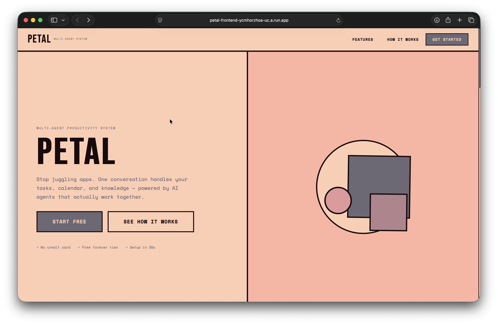
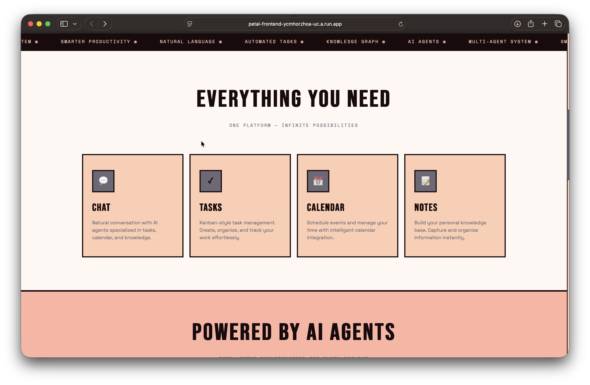
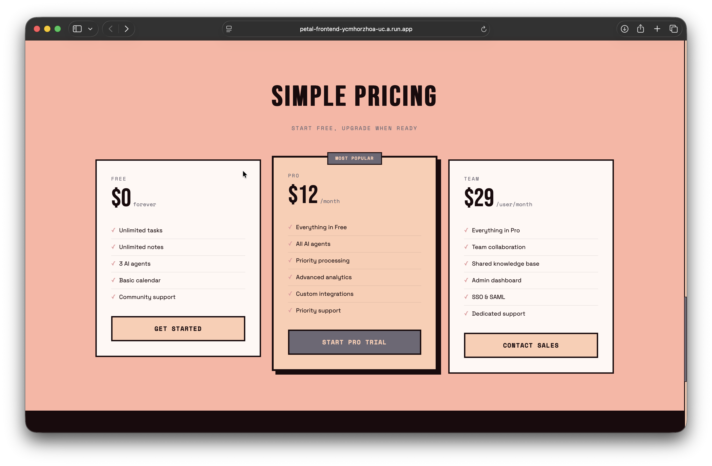
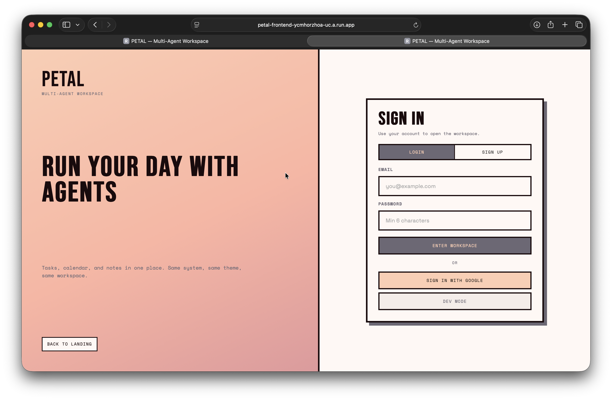
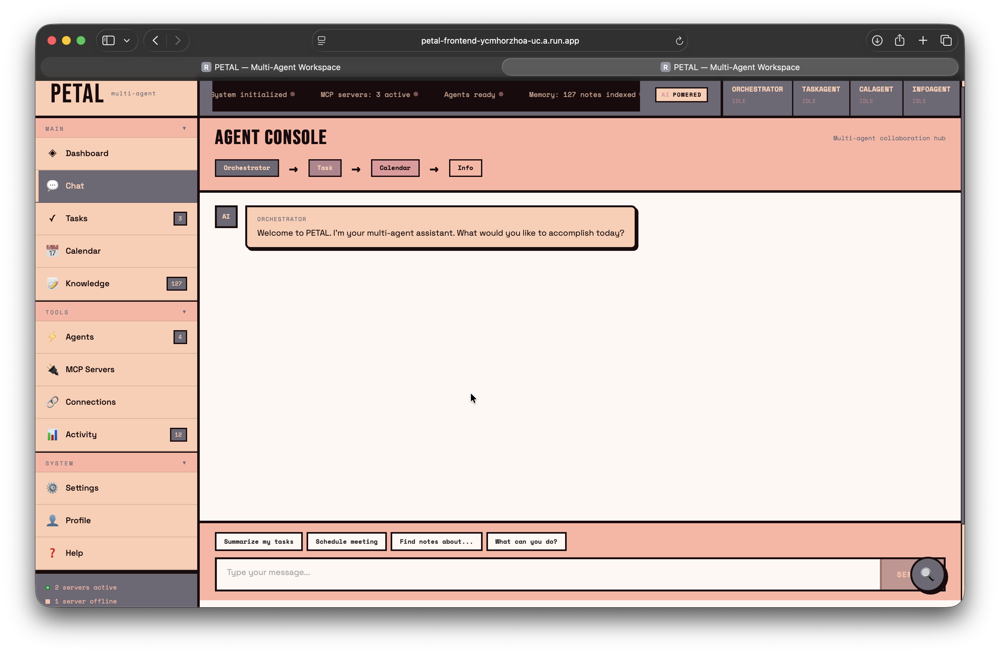
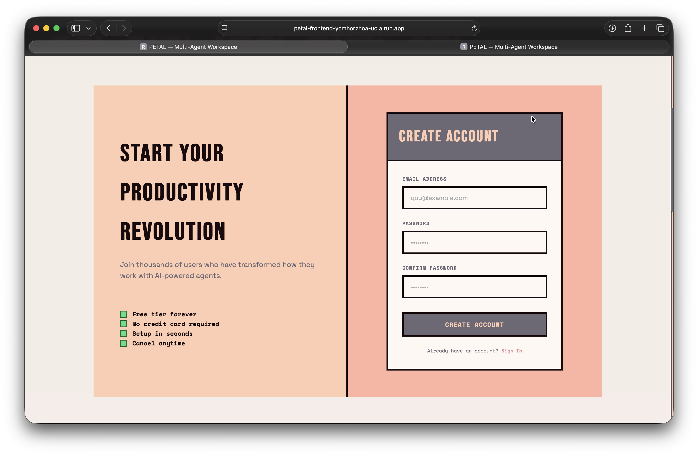
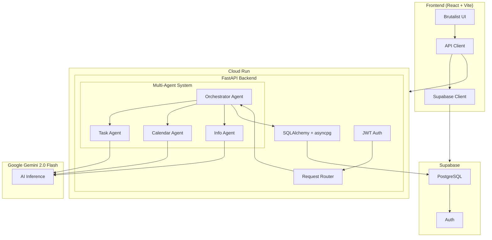
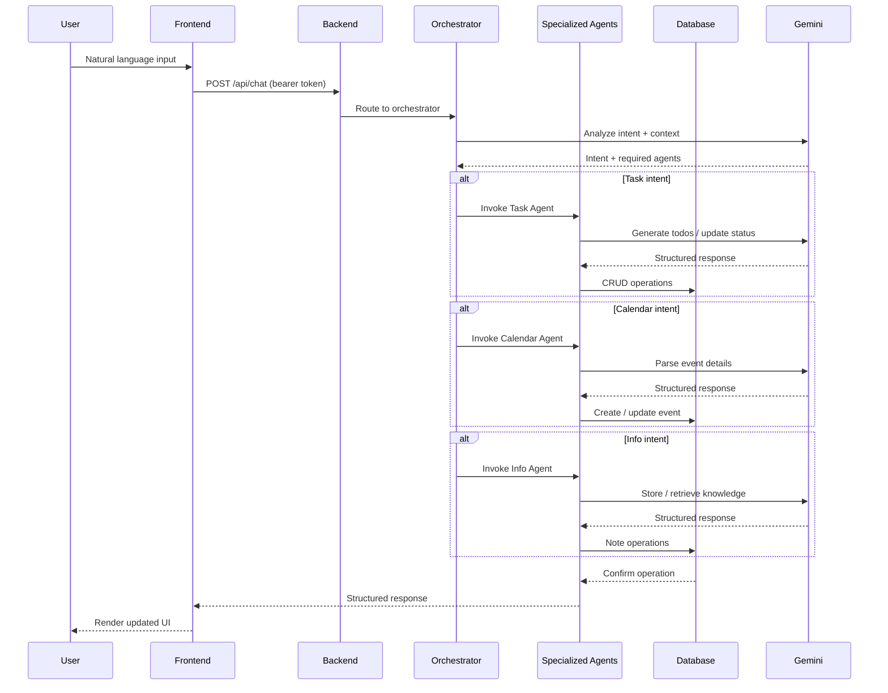

<p align="center">
  
</p>

<p align="center">
  <strong>PETAL</strong> is a multi-agent AI workspace for tasks, calendar, notes, and chat.<br>
  Built with FastAPI, React, Vite, Supabase, and Gemini.
</p>

PETAL combines a chat-first interface with specialized agents and MCP integrations so the workspace can act on natural language requests instead of treating them like static forms. The backend is built to keep working even when external services are slow or temporarily unavailable, using local fallbacks for calendar and notes flows where possible.

<p align="center">
  <a href="https://petal-frontend-ycmhorzhoa-uc.a.run.app"></a>
  <a href="https://petal-api-ycmhorzhoa-uc.a.run.app/health"></a>
  <a href="#local-setup"></a>
  <a href="#deployment"></a>
</p>

---

## Screenshots

<p align="center">
  
  
  
</p>
<p align="center">
  
  
  
</p>

---

## Tech Stack

| Layer | Technology | Badge |
|-------|-----------|-------|
| **Frontend** | React 18 |  |
| | Vite |  |
| | TypeScript |  |
| **Backend** | FastAPI |  |
| | Python |  |
| | SQLAlchemy |  |
| **Database** | PostgreSQL |  |
| | Supabase |  |
| **AI** | Gemini 2.0 Flash |  |
| **Cloud** | Docker |  |
| | Google Cloud Run |  |

---

## What PETAL Does

PETAL routes natural language requests through a small team of specialized agents:

- **Orchestrator** — routes requests and manages context
- **Task Agent** — manages todo workflows
- **Calendar Agent** — handles event scheduling
- **Info Agent** — stores notes and knowledge

The frontend is a brutalist, high-contrast interface designed to feel like one coherent workspace instead of separate apps.

In practice, the workspace is organized around four user goals:

- Chat with the orchestrator and let it route requests to the right agent.
- Manage tasks, calendar events, and notes in separate but connected views.
- Monitor backend, agent, and MCP health from the diagnostics and MCP pages.
- Deploy the same app to Cloud Run with clear separation between frontend delivery and backend APIs.

---

## Architecture



## Key Capabilities

- Multi-agent routing for task, calendar, and notes requests.
- Calendar scheduling that can sync to MCP-backed Google Calendar when available.
- Notes search and save flows with MCP support plus local fallback behavior.
- Live backend health, MCP status, and agent activity views in the frontend.
- Auth-aware routes with Supabase-backed sign-in, sign-up, password reset, and Google OAuth.

## Services

The backend exposes a few useful endpoints for day-to-day operations and deployment checks:

- `GET /health` for a fast service health check.
- `GET /api/v1/agents/status` for current agent states.
- `GET /api/v1/agents/healthcheck` for a deeper routing sanity check.
- `GET /api/v1/mcp/status` for MCP connectivity and latency.
- `POST /api/v1/chat` for the main chat entry point.

MCP integrations currently cover calendar and Gmail, with notes support optional via `NOTES_MCP_URL`. Calendar and notes features are designed to degrade gracefully if the external MCP service or database path is unavailable.

---

## App Flow



---

## Local Setup

```bash
cp .env.example .env
pip install -r requirements.txt
cd frontend && npm install
```

If you only want to run the backend, you can skip the frontend install. If you only want to inspect the frontend, the app will still boot with mocked or empty states, but auth and data-backed views are more useful once the backend is up.

**Backend:**

```bash
cd backend
python -m uvicorn main:app --reload --port 8080
```

**Frontend:**

```bash
cd frontend
npm run dev
```

For local development, Vite proxies `/api` requests to `http://localhost:8080`, so the frontend can talk to the backend without extra CORS setup.

---

## Environment

Use `.env.example` as the source of truth. Do not commit real keys or secrets.

The repo is configured to ignore `.env`, service-account JSON files under `config/keys/`, and Terraform variable files. Keep production credentials in Secret Manager or your deployment environment, not in source control.

Required variables:

```env
DATABASE_URL=
SUPABASE_URL=
SUPABASE_JWT_SECRET=
SUPABASE_ANON_KEY=
GEMINI_API_KEY=
GROQ_API_KEY=
JWT_SECRET=
ALLOWED_ORIGINS=
VITE_API_URL=
VITE_SUPABASE_URL=
VITE_SUPABASE_ANON_KEY=
```

Recommended values by environment:

- `DATABASE_URL` should point to a reachable Postgres endpoint or the deployment secret used by Cloud Run.
- `GEMINI_API_KEY` powers tool-calling and general orchestration when Gemini is enabled.
- `GROQ_API_KEY` is used as a fallback chat provider when Gemini is unavailable.
- `SUPABASE_ANON_KEY` is safe to expose to the frontend build, but still should be injected at build time rather than hardcoded.
- `GOOGLE_APPLICATION_CREDENTIALS` should reference a local file only during development; production should use workload identity or Secret Manager.

---

## Deployment

Backend deployment on Cloud Run:

```bash
./scripts/deploy-cloud-run.sh
```

Frontend build and deploy:

```bash
./scripts/deploy-frontend.sh
```

The frontend Cloud Build requires valid API/WS URLs and Supabase public config at build time. The deploy script reads `SUPABASE_URL` and `SUPABASE_ANON_KEY` from `.env` and injects them automatically.

The backend deploy script writes required runtime secrets to Secret Manager and mounts them into Cloud Run. It also rewrites obvious localhost MCP URLs so they do not accidentally get deployed into production.

Production URLs:

- Frontend: https://petal-frontend-ycmhorzhoa-uc.a.run.app
- Backend: https://petal-api-ycmhorzhoa-uc.a.run.app

If you change these service URLs, update the frontend Cloud Build substitutions and backend CORS configuration together.

---

## Security

Secrets are intentionally excluded from source control.

Ignored by default:

- `.env`, `.env.local`, `.env.production`
- `frontend/.env`, `frontend/.env.local`, `frontend/.env.production`
- `config/keys/*.json`
- `infrastructure/terraform/*.tfvars`
- Terraform state files
- Common private key formats

Before pushing, always verify that `git status` does not include `.env`, private JSON keys, or generated credential files. If a local secret slips into the working tree, remove it from the commit set before pushing.

---

## Repository Layout

```
backend/              FastAPI app, agents, routes, database
frontend/             React app, components, pages, styles
assets/               Logo and showcase images
infrastructure/       Terraform and migrations
scripts/              Deployment helpers
```

---

## Notes

- The app is designed to run with bearer-token auth and Cloud Run-friendly CORS.
- Build-time frontend env vars are required for the deployed Supabase client.
- If you change deployment URLs, update the frontend build args and the backend CORS origin list together.

## Troubleshooting

- If chat routes but no tool action happens, check the agent health page and confirm Gemini or Groq is configured.
- If calendar requests create local events but do not sync externally, verify `GCAL_MCP_URL` and the calendar MCP service health.
- If notes search is empty, confirm `NOTES_MCP_URL` or rely on the local notes fallback.
- If deployment fails, re-run the frontend build with production API and Supabase values and confirm the backend service account can read the required secrets.